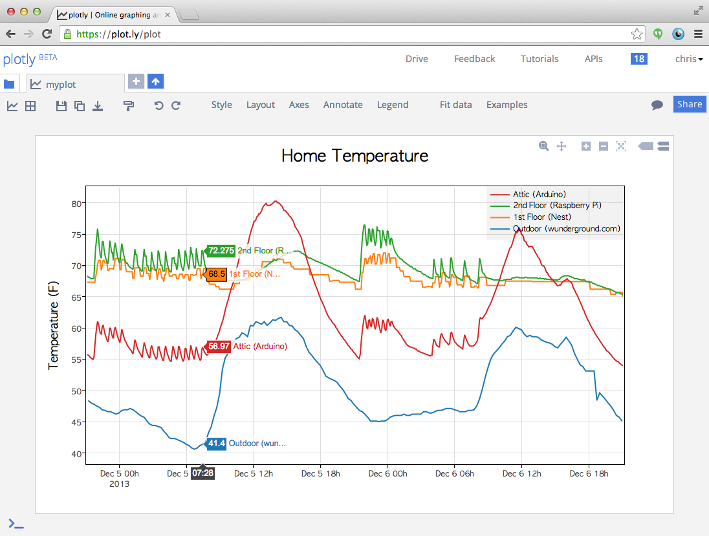

Plotly+Arduino <3
==
### Log, graph, share. 
Plotly+Arduino connects Arduinos to plotly's beautiful online graphing tool for real-time, interactive data logging and graphing.
[](https://plot.ly/~flann321/9)

Features
==
### Built-in, simplified date support
Logging time-stamped data is as simple as

```
void loop(){
    plotly.post(millis(), analogRead(3));
    delay(500);
}
```

All you need to do is attach a millisecond counter to the data points that you're logging. Plotly will convert the milliseconds into an absolute, local time for you all on plotly's server. No messy date-time string manipulation required.

### No SD card required
It's real lightweight. We tell plotly how many points we want to log, open up our connection, and send our points 1-by-1. No data-arrays being populated behind the scenes, no string manipulation, no messy date-time formatting required. Developed on a 32kb Arduino UNO with no extra memory. 

### It's just a lightweight wrapper around plotly's [REST API](https://plot.ly/api)
So if you want a different interface, jump in and submit a pull request. You might wanna check out the format of our JSON objects [here](https://plot.ly/api/rest).

Docs
==
Check out the example folder, it's all inclusive. 


Contact
==
- <chris@plot.ly>
- [@plotlygraphs](https://twitter.com/plotlygraphs)
- [Plotly Facebook](https://facebook.com/plotly)
