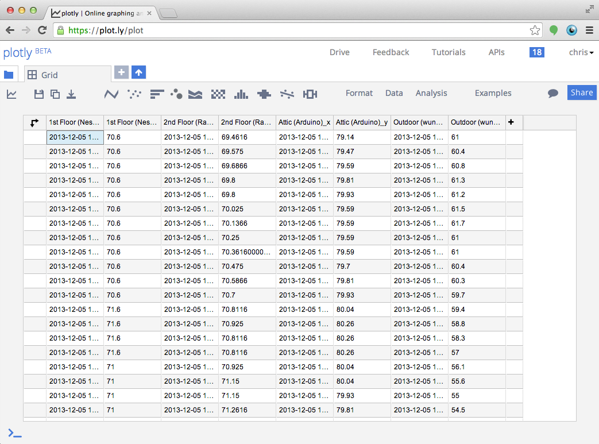
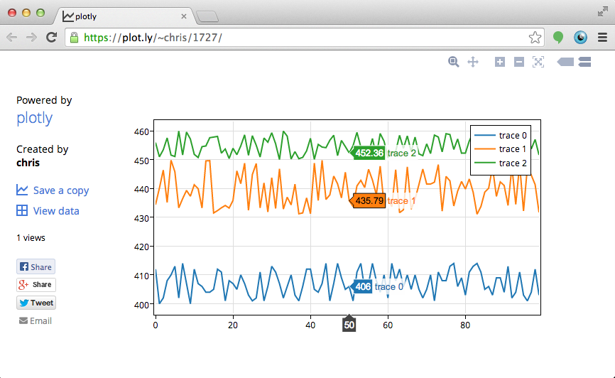
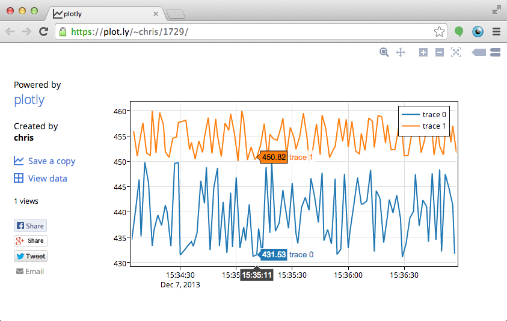

Plotly+Arduino
==
### Log, graph, share. 
Plotly+Arduino connects Arduinos to plotly's beautiful online graphing tool for real-time, interactive data logging and graphing. It's free for public use!
[](https://plot.ly/~flann321/9)

[](https://plot.ly/9/~flann321/data)

### In the wild
* [Plotly + Arduino Data Visualization Instructables](http://www.instructables.com/id/Plotly-Arduino-Data-Visualization/)
* [Arduino Blog](http://blog.arduino.cc/2013/11/04/create-interactive-graphs-logging-arduino-data-with-plotly/)
* [Local Space Weather](http://homepage.lnu.se/staff/pkumsi/GPS_Monitor.html)
* [Arduino Solar Monitor](http://plot.ly/~MarcoSmits/30/)
* [PiTemp](https://github.com/plotly/User-Projects/tree/master/PiTemp)
* [Temperature logging with RaspPi, Arduino, NEST, and Wunderground](https://plot.ly/~flann321/9)

### Built-in, simplified date support
Logging time-stamped data is as simple as

```C++
void loop(){
    plotly.post(millis(), analogRead(3));
    delay(500);
}
```

All you need to do is attach a millisecond counter to the data points that you're logging. Plotly will convert the milliseconds into an absolute, local time for you all on plotly's server. No messy date-time string manipulation required.

### No SD card required
It's real lightweight. We tell plotly how many points we want to log, open up our connection, and send our points 1-by-1. No data-arrays being populated behind the scenes and no string manipulation or messy date-time formatting required. Developed on a 32kb Arduino UNO with no extra memory. 

### It's just a lightweight wrapper around plotly's [REST API](https://plot.ly/api)
So if you want a different interface, jump in and submit a pull request. You might wanna check out the format of our JSON objects [here](https://plot.ly/api/rest).

Setup
==
###Step 1
Download and uncompress the latest [release](https://github.com/plotly/arduino-api/releases)

###Step 2 - Add to Library Folder
Place the plotly folder inside your local Arduino libaries folder, e.g. /Users/chris/Documents/Arduino/libraries. This folder is inside your default Sketchbook location which can be found inside the Arduino preferences. If the plotly folder is in the right place, then you should be able to select the plotly library from the Import Library...  option in the Arduino IDE (you may need to restart the IDE).

Tutorial
==
Check out the example folder for full, complete working examples. This section contains illustrative partials.

### Initialization

```C++
#include <SPI.h>
#include <Ethernet.h>
#include "plotly_ethernet.h"

byte mac[] = { 0xDE, 0xAD, 0xBE, 0xEF, 0xFE, 0xED };
byte my_ip[] = { 199, 168, 222, 18 }; 

void startEthernet(){
    Serial.println("Initializing ethernet");
    if(Ethernet.begin(mac) == 0){
        Serial.println("Failed to configure Ethernet using DHCP");
        // no point in carrying on, so do nothing forevermore:
        // try to congifure using IP address instead of DHCP:
        Ethernet.begin(mac, my_ip);
    }
    Serial.println("Done initializing ethernet");
    delay(1000);
}

void setup() {

  startEthernet(); // 

  // initialize a plotly object, named plotly
  plotly plotly; 
  
  plotly.VERBOSE = true; // turn to false to suppress printing over serial
  plotly.DRY_RUN = false; // turn to false when you want to connect to plotly's servers
  
  plotly.username = "public_arduino"; // your plotly username -- sign up at https://plot.ly/ssu or feel free to use this public account. password of the account is "password"
  plotly.api_key = "4z1r78yx9a"; // "public_arduino"'s api_key -- char api_key[10]  
}

```

### Log data
[](https://plot.ly/~chris/1727)
```C++
int nTraces = 3;    // Assign data to 3 different plot traces
int nPoints = 100;  // Send 100 points to each of these traces in each message to plotly
plotly.open_stream(nPoints, nTraces, filename, layout);
for(int i=0; i<nPoints; i++){
    plotly.post( i, analogRead(2) ); // Log a (x,y) point on trace 0
    plotly.post( i, (float) analogRead(3) ); // Log a (x, y) point on trace 1
    plotly.post( i, analogRead(4) ); // Log a (x, y) point on trace 2 
}
```
Note that the order in which data is added to the different traces is implicit. 
The first call to `plotly.post` will add data to the first trace, the second call to `plotly.post` will add data to the second trace. Once `plotly.post` has been called `nTraces` times, the next call to `plotly.post` will roll over back to the first trace.

After `plotly.post` is called `nTraces*nPoints` number of times, the connection to plotly terminates and a graph of your data will be saved in your plotly account.

To transmit multiple chunks of data, just use the same filename. Plotly will automatically extend the existing traces with the new chunk of data.

```C++
int nTraces = 2;
int nPoints = 500;
filename = "arduino data log";
layout = "{}";
int counter = 0;
void loop(){
  plotly.open_stream(nPoints, nTraces, filename, layout);
  for(int i=0; i<nPoints; i++){
    plotly.post( (counter*nPoints)+i, analogRead(2) ); // Log a (x,y) point on trace 0
    plotly.post( (counter*nPoints)+i, (float) analogRead(3) ); // Log a (x, y) point on trace 1
    delay(1000);
  }
  // Connection with plotly is implicitly closed, and each trace in your graph named "arduino data log"
  // is updated with 500 new points
  delay(2000);
  counter += 1;
}
```

### Logging timestamped data
**By timestamping with the millisecond counter**
[](https://plot.ly/~chris/1729)
Graph timeseries of your data by attaching a `millis()` value to your data points. Also toggle `plotly.timestamp` to `true` and provide your `timezone`.

```C++
void setup(){
  ...
  plotly.timestamp = true;
  plotly.timezeone = "America/Montreal"; // List of accepted timezones is in the parent folder, called "Accepted Timezone Strings.txt"

}

void loop(){
  for(int i=0; i<nPoints; i++){
    plotly.post( millis(), analogRead(2) ); // provide a millis() timestamp to trace0
    delay(750)
    plotly.post( millis(), analogRead(3) ); // provide a millis() timestamp to trace1
    delay(1000);
  }
  delay(2000);
}
```

**By providing a date-time formatted String or char array**

Plotly date-time strings must be in the format `YYYY-MM-DD hh:mm:ss`, e.g. `"2013-12-04 14:05:50"`.
```C++
  [...]
  plotly.post("2013-12-04 14:05:50", analogRead(2));
  plotly.post("2013-12-04 14:15:50", analogRead(2));
  [...]
```

### Layout information
Assign a plotly formatted JSON string to the `layout` argument of `plotly.openstream` to add a title, annotations, and  axes information. The JSON format of the `layout` argument can be found [here](https://plot.ly/api/rest).

Here are some common options:
```C++
    char layout[] = "{\"title\": \"Home Temperature\"\}"; // add a title named Home Temperature
    char layout[] = "{\"xaxis\": {\"title\": \"Time\"}, \"yaxis\": {\"title\": \"Voltage\"}}"; // label the x-axis "Time" and the y-axis "Voltage"
```
You can also edit the style of graph inside the online tool. The data that is streamed should not affect the style of the graph. 

### Contributing
* This library exposes a subset of the features available through the REST protocol. If you want a new interface, submit a pull request!

Contact
==
- <chris@plot.ly>
- [@plotlygraphs](https://twitter.com/plotlygraphs)
- [Plotly Facebook](https://facebook.com/plotly)
